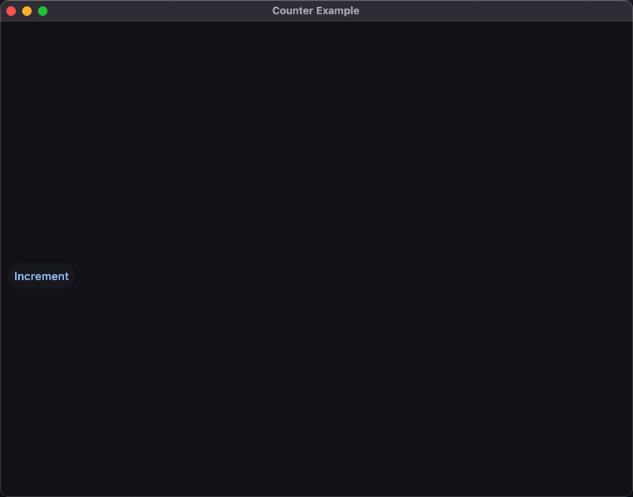
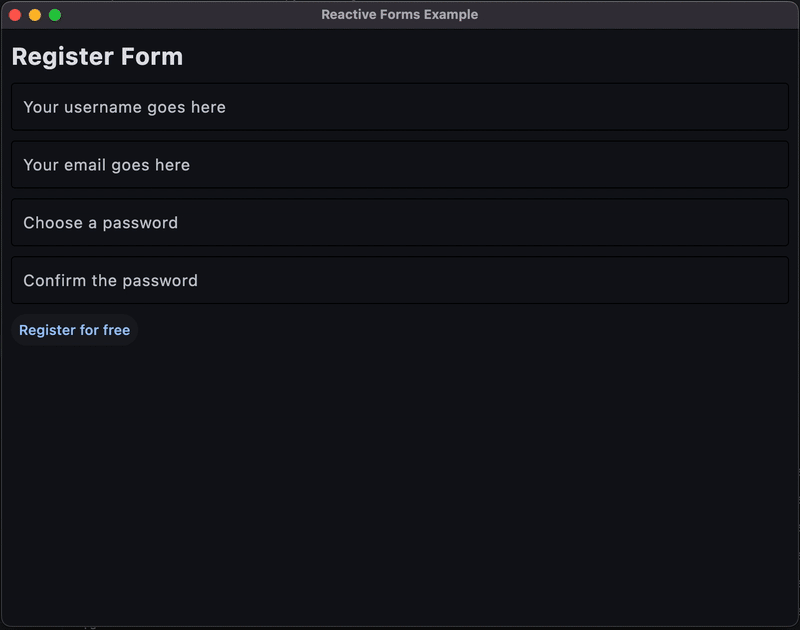

# FletX 🚀  
**The GetX-inspired Python Framework for Building Reactive, Cross-Platform Apps with Flet**

<!-- [](https://pypi.org/project/Flet-X/) -->
[](LICENSE)
[](https://discord.gg/your-link)

## Why FletX? ✨

FletX brings Flutter's beloved **GetX** patterns to Python, combining Flet's UI capabilities with:

- ⚡ **Reactive state management**  
- 🧭 **Declarative routing**  
- 💉 **Dependency injection**  
- 🧩 **Modular architecture**  
- 🎨 **Widget library**  

Perfect for building **desktop, web, and mobile apps** with Python at lightning speed.

---
## Showcases

<div align="center">
  <table>
    <tr>
      <td>
        
      </td>
      <td rowspan="2">
        
      </td>
    </tr>
    <tr >
      <td>
        
      </td>
    </tr>
  </table>
</div>


<!-- ### Counter App


### Toto App


### Reactive Forms
 -->

---
## Architecture


## Quick Start 🏁

### Installation
```bash
pip install FletX
```

### Basic Usage (Counter App)
```python
import flet as ft

from fletx.app import FletXApp
from fletx.core import (
    FletXPage, FletXController, RxInt, RxStr
)
from fletx.decorators import (
simple_reactive,
)


class CounterController(FletXController):
    count = RxInt(0)  # Reactive state


@simple_reactive(
    bindings={
        'value': 'text'
    }
)
class MyReactiveText(ft.Text):

    def __init__(self, rx_text: RxStr, **kwargs):
        self.text: RxStr = rx_text
        super().__init__(**kwargs)

class CounterPage(FletXPage):
    ctrl = CounterController()
    
    def build(self):
        return ft.Column(
            controls = [
                MyReactiveText(rx_text=self.ctrl.count, size=200, weight="bold"),
                ft.ElevatedButton(
                    "Increment",
                    on_click=lambda e: self.ctrl.count.increment()  # Auto UI update
                )
            ]
        )


def main(page: ft.Page):
    page.title = "Counter Example"
    page.theme_mode = ft.ThemeMode.LIGHT
    page.add(CounterPage().build())    # Add the CounterPage to the FletX page
    app = FletXApp(
        routes = {"/": CounterPage}
    )
    app._main(page)                    # Initialize the FletX application with the page

if __name__ == "__main__":
    ft.app(target=main)

```

---

## Core Features 🧠

### 1. Reactive State Management
```python
from fletx.core import RxStr, RxList 
from fletx.decorators import computed

class UserController(FletXController):
    name = RxStr("")
    todos = RxList([])
    
    @computed
    def todo_count(self) -> int:
        return len(self.todos)  # Auto-updates when todos change
```

### 2. Smart Routing
```python
# Define routes
routes = {
    "/": HomePage,
    "/profile/<:user_id>": ProfilePage,  # Dynamic route
    "/settings": SettingsPage
}

# Navigate programmatically
FletXRouter.to("/profile/123", transition=SlideTransition())

# With route guards
FletXRouter.add_route_guard("/admin", AdminGuard())
```

### 3. Dependency Injection
```python
# Register services
FletX.put(AuthService(), tag="auth")

# Retrieve anywhere
auth_service = FletX.find(AuthService, tag="auth")
```

### 4. Ready-to-Use Widgets
```python
from fletx.widgets import (
    FletXCard,
    FletXResponsiveRow,
    FletXProgressRing
)
```

---

## Architecture Overview 🏗️

```
my_app/
├── main.py          # App entry point
├── routes.py        # Route definitions
├── controllers/     # Business logic
│   ├── auth.py
│   └── user.py
├── pages/           # UI components
│   ├── home.py
│   └── profile.py
└── models/          # Data models
    └── user.py
```

---

## Advanced Usage 🛠️

### Custom Transitions
```python
from fletx.core.navigation.transitions import RouteTransition

FletXRouter.to(
    "/dashboard",
    transition=RouteTransition(
        type="fade",
        duration=500
    )
)
```

### Middleware
```python
class AnalyticsMiddleware:
    def run_before(self, route_info):
        log_navigation(route_info.path)

FletXRouter.add_middleware(AnalyticsMiddleware())
```

---

## Performance Benchmarks 📊

| Operation         | FletX | Pure Flet |
|-------------------|-------|-----------|
| State Update      | 0.2ms | 1.5ms     |
| Route Navigation  | 5ms   | 15ms      |
| DI Resolution     | 0.1ms | N/A       |

---

## Community & Support 💬

- [Documentation](https://fletx.dev/docs) 📚
- [Discord Community](https://discord.gg/your-link) 💬
- [Issue Tracker](https://github.com/AllDotPy/FletX/issues) 🐛

---

## Roadmap 🗺️

- [x] **Step 1** — **Fondation**
    > ⚙️ **Goal** : build thechnical bases and essential abstractions. 
- [x] **Step 2** — **State Management + DI**
    > 🎯 **Goal** : Enable reactive state management.
- [x] **Step 3** — **Advanced navigation**
    > 🧭 **Goal** : Add support for modular and nested routing, middlewares and Guards.
- [ ] **Step 4** — **UI Components**
    > 🧱 **Goal** : Add ready to use reactive UI components (enabling extensibility).
- [ ] **Step 5** — **Utilities & CLI**
    > 🛠️ **Goal** : Add tools to boost DX (developer experience).
- [ ] **Step 6** — **Write Documentation**
    > 📚 **Goal** : Write FletX's documentation.

### Currently Working on

- [x] Add @reactive_control to allow converting flet Controls into a FletX reactive Widgets
- [ ] Add Ready to use Reactive Widgets or components
- [ ] FletX CLI tool Eg: `fletx new my_project`; `fletx generate module my_project/my_module`
- [ ] Write Documentation

### For the next version

- [ ] Improve Actual routing system (enabling devs to create subrouters for modules)
- [ ] Add Screen Management System for Page Widgets 
- [ ] Enhanced dev tools
- [ ] VS Code extension

---

## 🤝 Contributing

We welcome contributions from the community! Please see the [CONTRIBUTING.md](CONTRIBUTING.md) guide for more information.

---

## License 📜

MIT © 2023 AllDotPy

```bash
# Happy coding! 
# Let's build amazing apps with Python 🐍
```

<br>
<p align = 'center'>
    </img>
</p>
<p align = 'center'>Made with ❤️ By AllDotPy</p>
